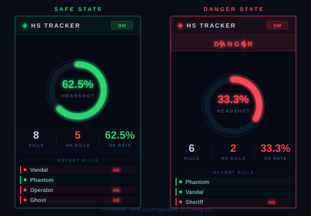

# HS Tracker — VALORANT Deathmatch Headshot Rate Tracker

An [Overwolf](https://www.overwolf.com/) in-game overlay that tracks your **headshot kill rate in real time** during VALORANT Deathmatch and other modes where the official HS% stat is unavailable.

---

## The Problem

VALORANT's scoreboard only shows headshot percentage for standard competitive/unrated matches, and only after each round ends. In **Deathmatch** and **Skirmish** — the modes where most aim training happens — there is no real-time HS% feedback whatsoever.

## The Solution

HS Tracker listens to Overwolf's `kill_feed` game event, which fires on every kill and includes a `headshot` boolean. By tracking **headshot kills ÷ total kills**, the app calculates an approximated HS rate and displays it live on an in-game overlay, giving you immediate feedback while you practice.

> **Note on accuracy:** This metric counts *kills secured with a headshot*, not raw headshot hits. It's a practical proxy for aim quality — the same "HS Kill%" shown in some third-party trackers.

---

## Preview



| State | Condition | Visual |
|---|---|---|
| **SAFE** | HS rate ≥ threshold | Green gauge, green border |
| **DANGER** | HS rate < threshold | Red gauge, pulsing border, ⚡ DANGER ⚡ banner |

---

## Features

- **Real-time HS rate gauge** — circular progress display, updates on every kill
- **SAFE / DANGER threshold** — configurable %, overlay switches color state when you drop below it
- **Recent kill feed** — last 6 kills with weapon name and HS indicator
- **Per-kill stats** — total kills, HS kills, HS rate shown at a glance
- **Webhook support** — sends kill events and session stats to any HTTP endpoint (Discord, custom server, etc.)
- **Hotkey toggle** — `Shift+F1` to show/hide the overlay without leaving the game

---

## How It Works

```
VALORANT  ──kill_feed event──►  background.js  ──stats──►  overlay.js
                                      │
                                      └──POST JSON──►  Webhook endpoint
```

1. `background.js` registers `kill`, `match_info`, and `me` features via `overwolf.games.events.setRequiredFeatures`
2. On each `kill_feed` event, it checks if the attacker is the local player (`"Me"` or `player_name`)
3. Stats are updated and sent to the overlay window via `overwolf.windows.sendMessage`
4. If `WEBHOOK_URL` is configured, a JSON payload is POSTed on each kill and at match end

---

## Installation

> Requires [Overwolf](https://www.overwolf.com/) with **Developer Mode** enabled.

### Enable Developer Mode
1. Open Overwolf settings → **About**
2. Rapidly click the version number **5–6 times**
3. "Developer mode enabled" message appears

### Load the App
1. In Overwolf settings → **Support → Development Options**
2. Click **"Load unpacked extension"**
3. Select the `HSTracker` folder
4. Launch VALORANT and start a Deathmatch

---

## Configuration

Edit **`config.js`** before loading:

```js
const CONFIG = {
  // Your webhook endpoint (Discord, custom server, etc.)
  WEBHOOK_URL: 'YOUR_WEBHOOK_URL_HERE',

  // HS rate below this % triggers DANGER state
  HS_THRESHOLD: 50,

  WEBHOOK_EVENTS: {
    ON_KILL: true,       // send on every kill
    ON_MATCH_END: true,  // send session summary at match end
    PERIODIC: false,     // send on a timer
  },

  PERIODIC_INTERVAL_SEC: 30,
  MAX_RECENT_KILLS: 6,
};
```

---

## Webhook Payload

### Kill event (`ON_KILL`)
```json
{
  "event": "kill",
  "timestamp": "2026-05-29T12:34:56.789Z",
  "game": "VALORANT",
  "mode": "deathmatch",
  "kill": {
    "weapon": "Vandal",
    "headshot": true,
    "victim": "Player123"
  },
  "stats": {
    "totalKills": 7,
    "hsKills": 4,
    "hsRate": 57.1
  }
}
```

### Match end event (`ON_MATCH_END`)
```json
{
  "event": "match_end",
  "timestamp": "...",
  "game": "VALORANT",
  "mode": "deathmatch",
  "sessionStart": "...",
  "sessionEnd": "...",
  "stats": {
    "totalKills": 20,
    "hsKills": 11,
    "hsRate": 55.0,
    "weaponStats": {
      "Vandal": { "kills": 12, "hsKills": 8 },
      "Ghost":  { "kills": 8,  "hsKills": 3 }
    }
  }
}
```

---

## Hotkeys

| Key | Action |
|---|---|
| `Shift+F1` | Toggle overlay visibility |

---

## File Structure

```
HSTracker/
├── manifest.json          # Overwolf app manifest (VALORANT game ID: 21640)
├── config.js              # Webhook URL & threshold settings
├── icons/
│   ├── icon.png
│   └── icon_gray.png
├── background/
│   ├── background.html
│   └── background.js      # Event listener, stats engine, webhook sender
├── overlay/
│   ├── overlay.html        # In-game overlay UI
│   ├── overlay.css         # Gaming aesthetic (dark + cyan/green/red)
│   └── overlay.js          # Gauge animation, SAFE/DANGER state
└── docs/
    └── preview.svg
```

---

## Limitations

- **HS Kill rate ≠ HS hit rate.** The overlay shows kills where the final hit was a headshot, not every headshot landed. This is the only granularity available from Overwolf's `kill_feed` event in non-round-based modes.
- Player name matching uses `"Me"` fallback for players with hidden names, but agent-name display may vary by region.
- The overlay is read-only and provides no in-game advantage — it only surfaces post-kill statistics.
